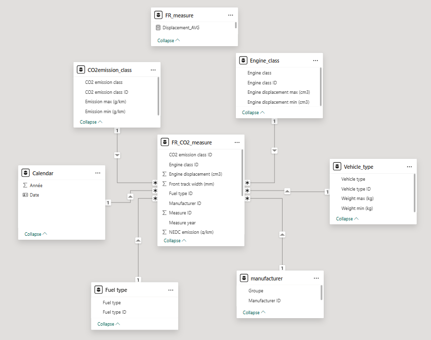

# 🌍 Analyse des émissions de CO₂ des véhicules en Europe

## 🎯 Contexte du projet

Ce projet de fin d’études porte sur l’analyse des émissions de CO₂ des véhicules particuliers en Europe, à partir de données issues des procédures d’homologation avant mise sur le marché.

L’objectif est d’étudier l’évolution des émissions sur les deux dernières décennies et d’analyser l’impact des évolutions réglementaires (NEDC → WLTP) ainsi que les tendances du marché automobile.

---

## ❓ Problématique

Dans quelle mesure l’évolution des émissions de CO₂ des véhicules est-elle expliquée par les transformations des caractéristiques techniques (motorisation, puissance, cylindrée, masse, type de transmission), et quels facteurs apparaissent comme les principaux leviers d’influence sur ces émissions au cours des deux dernières décennies ?

---

## 🧭 Organisation du projet

Afin de répondre à la problématique, l’analyse a été structurée autour de trois axes complémentaires permettant de croiser évolution temporelle, changement de normes et facteurs explicatifs des émissions de CO₂.

---

### 🟦 1. Analyse exploratoire et compréhension des facteurs (Python)

📍 France — 2001 à 2015 — Norme NEDC

Cette première étape vise à analyser les émissions de CO₂ dans un cadre historique homogène, afin d’identifier les relations entre les caractéristiques techniques des véhicules et leurs niveaux d’émissions.

Axes étudiés :
- motorisation
- puissance
- masse du véhicule
- type de boîte de vitesse

👉 Cette phase permet de comprendre les principaux déterminants des émissions et leurs interactions.

---

### 🟧 2. Analyse de la période récente et rupture réglementaire (Power BI)

📍 France — 2018 à 2023 — Norme WLTP

Cette deuxième étape se concentre sur les données récentes intégrant la norme WLTP, plus représentative des conditions réelles d’utilisation.

Axes étudiés :
- évolution des émissions dans le temps
- impact des caractéristiques techniques sur les émissions
- analyse des tendances récentes du marché automobile

👉 Cette phase permet d’observer l’évolution des émissions dans un contexte de changement méthodologique.

---

### 🟩 3. Analyse comparative et synthèse des facteurs (Power BI – Soutenance)

📍 5 pays européens les plus peuplés — 2021 à 2023

Cette dernière étape élargit l’analyse à une dimension européenne afin de comparer les niveaux d’émissions et les structures de marché entre pays.

Axes étudiés :
- comparaison des émissions moyennes entre pays
- influence des caractéristiques techniques à l’échelle européenne
- synthèse des principaux facteurs explicatifs

👉 Cette phase permet de hiérarchiser les facteurs influençant les émissions dans un contexte international.

---

## 🧭 Contexte de la soutenance

Lors de la soutenance, une mise en situation a été réalisée en se plaçant dans la peau d’un cabinet d’analystes spécialisés dans le secteur automobile.

Cette simulation visait à présenter les résultats dans un cadre de conseil auprès du Ministère de la Transition Écologique afin d’illustrer des pistes de réflexion sur la réduction des émissions du transport individuel.

👉 Cette approche concerne uniquement la soutenance et le dashboard associé.

---

## 🧩 Aperçu du projet

### 🧱 Modélisation des données

### 📊 Dashboard France (WLTP)

### 🌍 Dashboard Europe (Soutenance)

---

## 🛠️ Technologies utilisées

- Python (Pandas, NumPy, Matplotlib, Seaborn)
- Jupyter Notebook (analyse exploratoire)
- Power BI (dashboards interactifs)
- Modélisation en schéma en étoile

---

## 📦 Livrables

- Notebook d’analyse exploratoire (Python) - France (NEDC)
- Dashboard Power BI – France (WLTP)
- Dashboard Power BI – Europe (Soutenance)
- Rapport final de synthèse (PDF)
- Synthèse des insights de soutenance

---

## 🎓 Conclusion

Ce projet met en évidence l’évolution des émissions de CO₂ des véhicules en Europe à travers une approche progressive combinant analyse historique, évolution réglementaire et comparaison internationale.

Il illustre la capacité à :
- analyser des données complexes sur plusieurs périodes
- gérer des changements de méthodologie (NEDC → WLTP)
- produire des visualisations orientées analyse et décision

---

## 👤 Auteur

AUROUX Jacinthe
Data Analyst

🔗 LinkedIn : https://linkedin.com/in/jacinthe-auroux-619863b6
